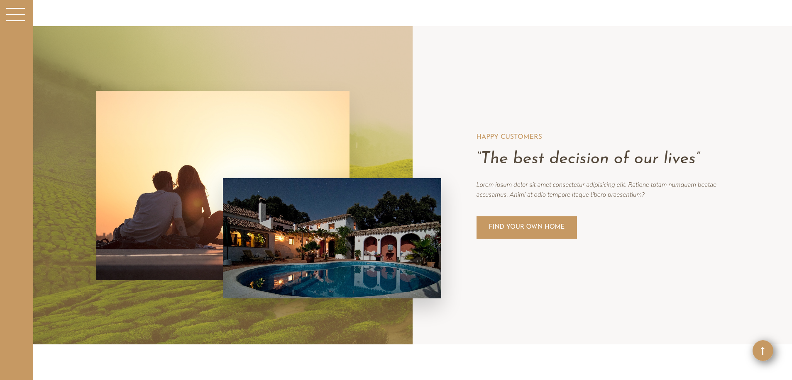

<p align="center">
  <a href="https://nexter-react.netlify.app/" rel="noopener">
 </a>
</p>

<h3 align="center">Nexter</h3>

<div align="center">

[]()
[](/LICENSE)

</div>

---

<p align="center"> The ultimate personal freedom
    <br> 
</p>

## Table of Contents

- [About](#about)
- [Getting Started](#getting_started)
- [Deployment](#deployment)
- [Usage](#usage)
- [Built Using](#built_using)
- [Authors](#authors)

## About <a name = "about"></a>

This project is a React version of nexter, a real estate website design built using CSS Grids. 

## Getting Started <a name = "getting_started"></a>

These instructions will get you a copy of the project up and running on your local machine for development and testing purposes. See [deployment](#deployment) for notes on how to deploy the project on a live system.

### Prerequisites

You will need to have [Nodejs](https://nodejs.org/en/) in your system.

Check the documentation to install it on your system.

### Installing

Once you have Node Js on your system, run `npm install` in order to get all the dependencies needed. You can see in the package.json all the scripts.

```
  "scripts": {
    "dev": "vite",
    "build": "vite build",
    "preview": "vite preview"
  },
```

## Usage <a name="usage"></a>

</a>

You can make changes in the components and pages folders.
Run `npm run dev` to see in the browser all the changes that you do in the page.

## Deployment <a name = "deployment"></a>

You can deploy this page to Netlify.

## Built Using <a name = "built_using"></a>

- [React](https://reactjs.org/) - A JavaScript library for building user interfaces
- [Sass](https://sass-lang.com/) - CSS with superpowers 
- [Vite](https://sass-lang.com/) - Next Generation Frontend Tooling

## Authors <a name = "authors"></a>

- [@alejandrocardozo](https://github.com/Alejandro-Cardozo) - Build by
- [@jonasschmedtmann](https://github.com/jonasschmedtmann) - Idea & Initial Work